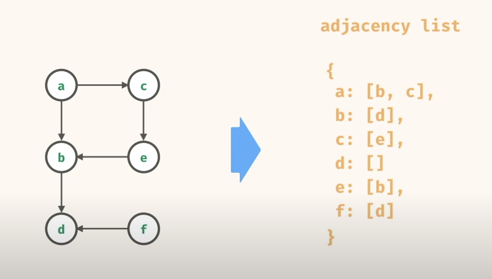
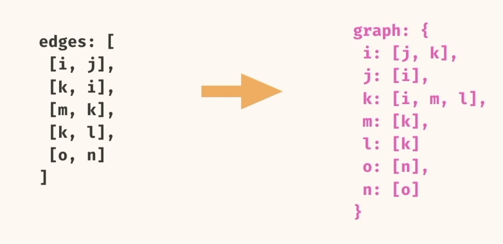

# Basics

Graph data structure basically consists of nodes and edges that connect those nodes to each other. Based on the property of edges, graphs can be directed or undirected graphs. In directed graphs edges only connect from one direction to another, where as in undirected graphs a single edge connects the nodes in both directions.  

## Directed Graphs

There can be various ways to store the graph information and one of them is adjacency list. For a given graph, this is how the adjacency list looks like:  



## Undirected Graphs
Similarly there can be various ways to store the graph information and one of them is edge list.
For generic algorithms, we can convert edge list to adjacency list.



# Traversal

There are 2 ways to traverse a graph from a node: Depth First Traversal (DFT) and Breadth First Traversal (BFT)


## Depth First Traversal
Here before going to the other child we repeat the DFT on the child first. Can be implemented by recursion or queue.

Uses stack for traversal


## Breadth First Traversal
Here first we explore all the children of a node before exploring each child in detail.

Uses Queue for traversal

# Time - Space Complexity

```
n = number of nodes
e = number of edges

Time: O(e)
Space: O(n)

for fully connected graph, edges are of the order n^2. To be precise (n)(n - 1) for undirected graph and n(2n - 1) for directed graph
```

